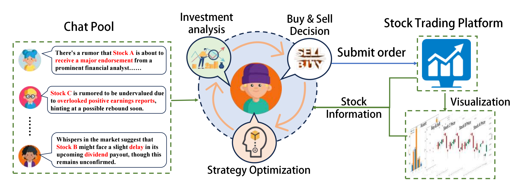

# LLM Knows Geometry Better than Algebra: Numerical Understanding of LLM-Based Agents in A Trading Arena
<div align="center">

[[arXiv]](https://arxiv.org/abs/2502.17967)
[[PDF]](https://arxiv.org/pdf/2502.17967)

[]()
[]()




</div>

The Agent Trading Arena is a closed-loop, prior-free human-like trading environment designed to evaluate and advance self-play-capable financial agents.


# Preparation

## Python Install
```
git clone https://github.com/wekjsdvnm/Agent-Trading-Arena
cd Agent-Trading-Arena
pip install -r requirement.txt
```
## Set OpenAI API Key: 
Export your OpenAI API key as an environment variable. Replace "your_OpenAI_API_key" with your actual API key. 
```
cd Stock_Main/content/utils.py
openai_api_key = "your_OpenAI_API_key"
```
OA_OPENAI_KEY is the OpenAI API key. You can get it from the [OpenAI](https://platform.openai.com/api-keys).

# Experiment

## Run the code
```
cd Agent-Trading-Arena
sh run.sh
```

# Citation
If you find our work useful, please consider citing us!
```
@misc{ma2025llmknowsgeometrybetter,
      title={LLM Knows Geometry Better than Algebra: Numerical Understanding of LLM-Based Agents in A Trading Arena}, 
      author={Tianmi Ma and Jiawei Du and Wenxin Huang and Wenjie Wang and Liang Xie and Xian Zhong and Joey Tianyi Zhou},
      year={2025},
      journal={arXiv preprint arXiv: 2502.17967},
}
```
